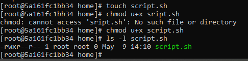

# Relatório da Atividade da Introdução ao Linux usando o Docker no Windows

**Nome:** Ícaro Gabriel Pereira Carvalho  
**Data:** 09/05/2025

---

## Introdução

### Objetivo do Exercício

Proporcionar aos alunos uma iniciação ao Linux e a possibilidade de realizar essa atividade usando o Docker, que é o sistema que está sendo visto na matéria. Ao fazer o uso do Docker, conseguimos criar containers com a imagem do Linux, no caso, o Fedora, para fazer uso do terminal Linux mesmo no Windows. Com isso, é possível treinar o uso dos comandos do Docker e aprender um pouco sobre o Linux para outras atividades futuras.

---

## Relato

### Navegação Básica

  
A introdução foi feita criando um container com a imagem do Linux. Foi possível observar em qual diretório há a iniciação do container e como podemos navegar por ele e observar diretórios por dentro. Já foi possível criar um novo diretório, entrar nele e sair, mostrando como funciona para se locomover pelos diretórios, podendo explorar ainda mais o sistema e criar coisas novas.

### Manipulação de Arquivos

  
Nesta segunda parte, checo em qual diretório estou e vou para o `~`. Lá, crio um arquivo, já sendo introduzido à lógica de criação de arquivos, mas sem mostrar nada a respeito de edição por enquanto, e já mudo seu nome, mostrando dois comandos novos: o `touch` e o `mv`. Voltando à pasta criada anteriormente, ou seja, a de atividades, crio mais uma pasta, chamada `backup`, e uso um novo comando que me permite copiar o documento que eu havia criado para a pasta `backup` criada mais recentemente. Com isso, é possível voltar para a pasta onde eu tinha criado e renomeado o arquivo, e posso excluir, indo de volta para a pasta `backup` e conferindo que o arquivo criado, renomeado e excluído está lá salvo. Com essa segunda etapa, foi possível aprender ainda mais comandos básicos do Linux, dessa vez envolvendo o contexto dos arquivos: criação, renomeação, cópia e exclusão.

### Gerenciamento de Pacotes

  
Nesta etapa, é necessário usar o comando `dnf update` para atualizar a lista de pacotes. Com ele atualizado, podemos instalar o `nano`, que é um editor de texto, verificar a sua versão e, por fim, removê-lo. Esta etapa é essencial por mostrar que o Linux não oferece todas as funções de cara, sendo necessário instalar e, depois, remover pacotes, mostrando que não fica instalado para sempre.

### Permissões de Arquivos

  
Nesta etapa, crio um novo arquivo com o comando `touch`, visto na etapa anterior, com a extensão `.sh`, dando permissão de execução ao dono. Ou seja, o `chmod` é o comando responsável por alterar as permissões de arquivos, o `u` se refere ao usuário proprietário, o `+x` adiciona a permissão de execução e, por fim, se coloca o nome do arquivo, verificando suas permissões. Nesta etapa, não ficou claro a real funcionalidade de dar permissão a um arquivo no Linux, mas foi possível aprender mais comandos básicos e introdutórios.

### Processos em Execução

  
Nesta etapa, sou indicado a usar o comando `ps`, sendo um comando não oferecido de início, sendo necessário instalá-lo usando a lógica mostrada no tópico de gerenciamento de pacotes. Agora, com o `ps` instalado, posso usá-lo para verificar os processos em execução. Ao usar o comando `sleep` com o `&`, inicia-se um processo em segundo plano, podendo agora vê-lo e matá-lo usando o comando `kill`, encerrando o processo, que não aparece mais quando uso novamente o comando para verificar os processos. Depois de realizado, esta etapa concluiu o conhecimento sobre como iniciar e encerrar processos, podendo encerrar vários processos por ser um container do Docker, sem afetar um computador de verdade.

### Encerrando o Container

  
Por fim, saio do container e o removo, mostrando que ele também pode ser removido pelo terminal, mesmo sem usar o comando de remoção ao fechar, quando foi iniciado.

---

## Conclusão

### O que aprendi?

Eu nunca tinha usado Linux e nunca tinha tido contato com os seus comandos e funcionalidades. Todas as coisas vistas na atividade foram novidades para mim e começaram a abrir a minha mente sobre como funciona o Linux e suas possibilidades.

### Dificuldades

Por seguir o tutorial, não houveram dificuldades reais. No máximo, errei o comando ou fiquei perdido no meio de tantos diretórios.
